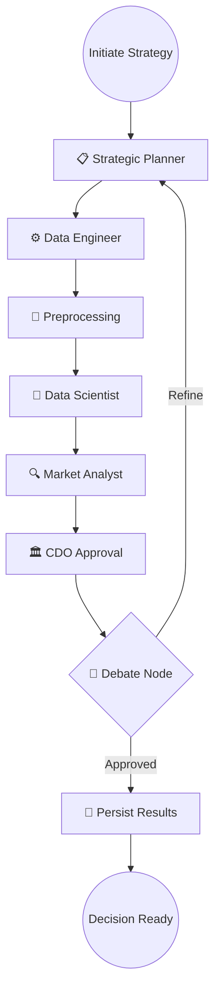
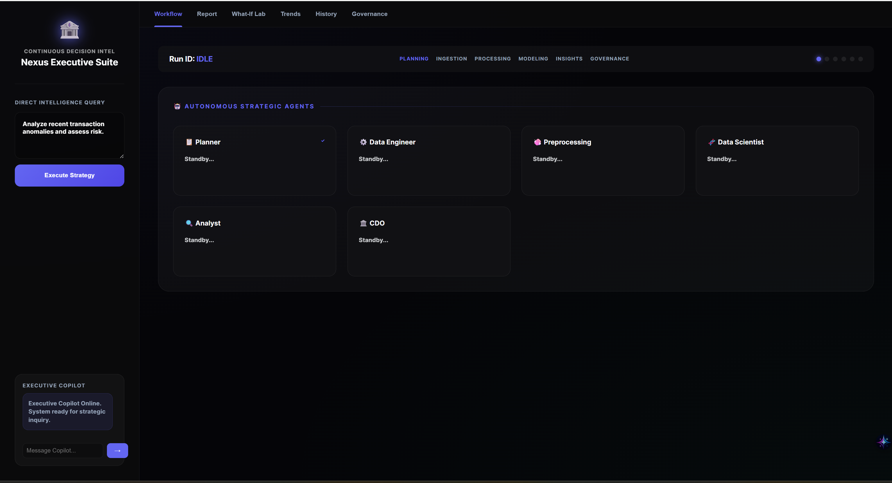
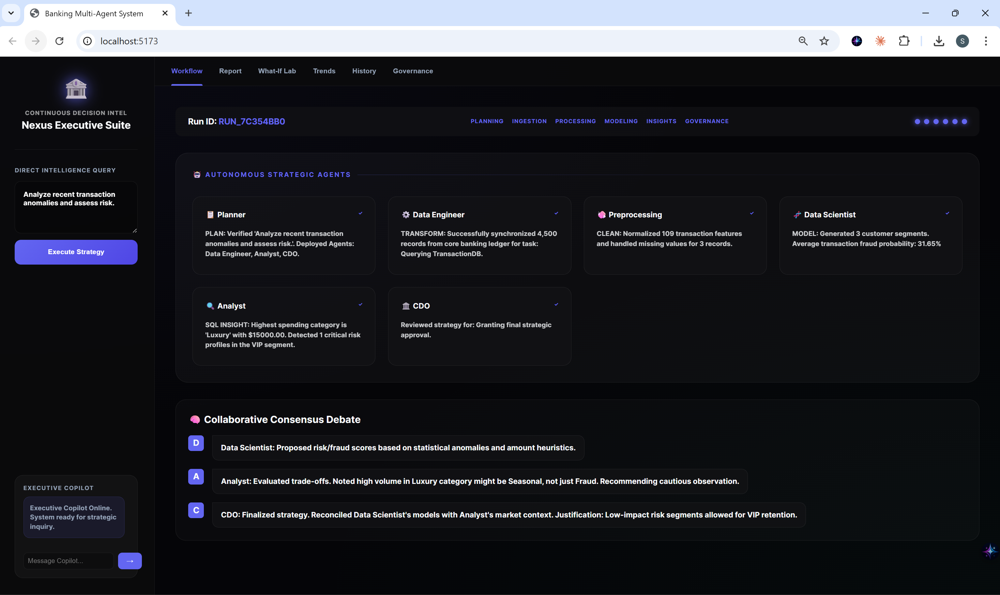
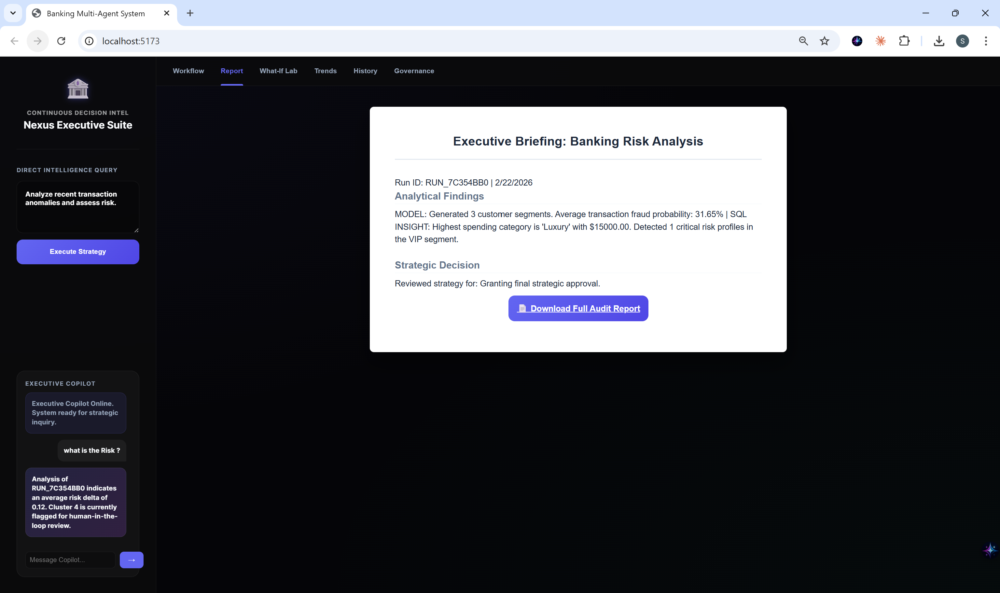
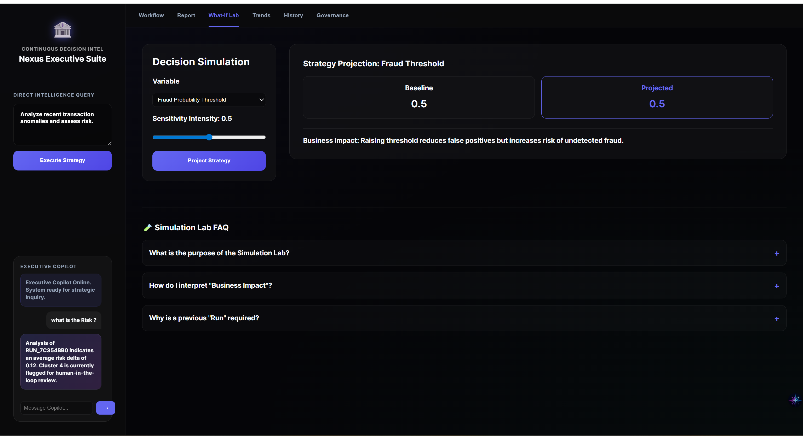
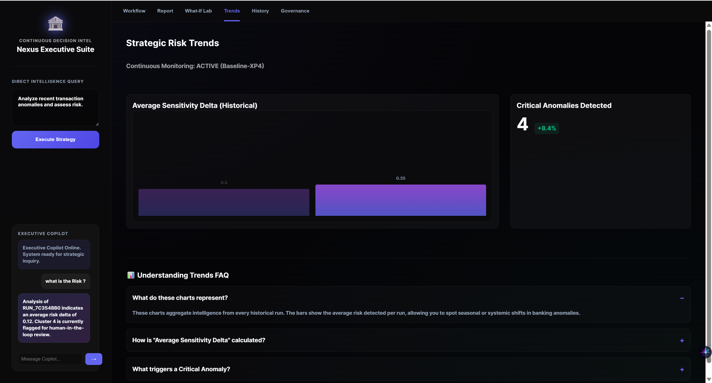
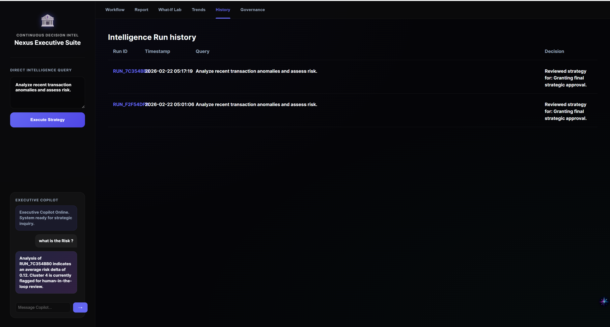
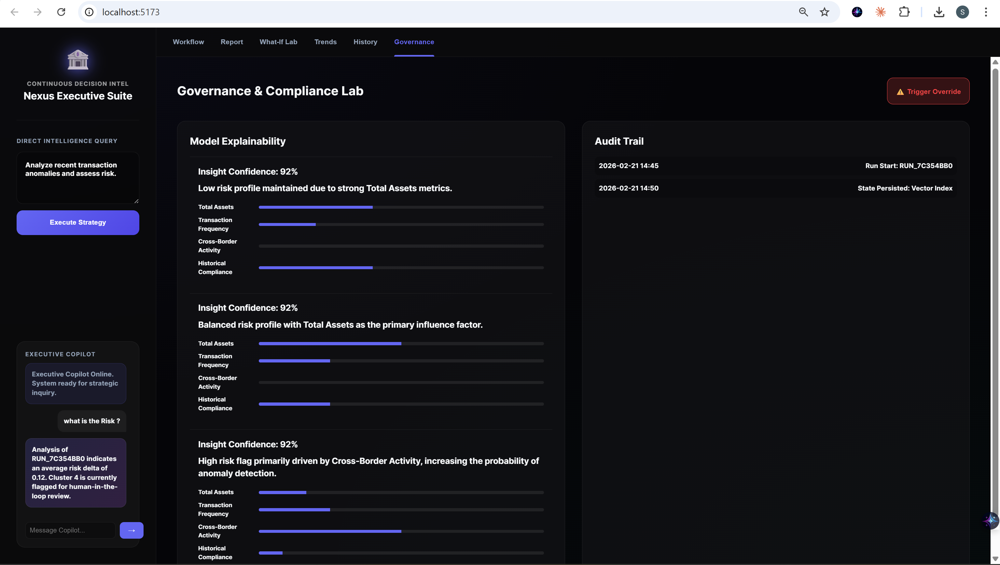

# 🏦 NexusAI: Autonomous Banking Decision Intelligence Platform

NexusAI is a premium, high-fidelity Executive Decision Suite. It transforms complex banking data into actionable strategic insights using a multi-agent orchestrated workflow. It autonomously handles fraud detection, risk assessment, and customer segmentation while providing a high-end interface for executive oversight and "What-If" scenario planning.

---

# 🚀 Key Capabilities
| Capability | Description |
|------|--------------|
| **Multi-Agent Orchestration** | LangGraph-driven workflow featuring Planner, Data Engineer, and Scientist agents. |
| **Collaborative Consensus** | Real-time "Debate Mode" where agents challenge and refine each other's findings. |
| **What-If Lab** | Dynamic simulation engine to project the business impact of policy changes. |
| **Executive Copilot** | An AI-powered interactive assistant for strategic inquiries and instant summaries. |
| **Predictive Modeling** | Integrated Fraud prediction and Customer Lifetime Value (CLV) segmentation. |
| **Explainable AI (XAI)** | Detailed feature importance and plain-English reasoning for every decision. |
| **Audit-Ready Reporting** | Automatic generation of PDF audit reports and persistent historical logs. |

---

# 🧠 High-Level Agentic Workflow


---

# 🧩 Decision Logic (Core Idea)
The platform operates on a **Consensus-Driven Intelligence** model. No single agent makes an isolated decision. Instead:
1. **Planner** sets the analytical bounds.
2. **Specialized Agents** execute their domain-specific code (SQL, Python, Modeling).
3. **CDO & Analyst** perform a validation debate to ensure the decision meets regulatory and business standards.
4. **Explainability Engine** translates complex vector weights into executive-friendly language.

---

# 📁 Project Structure
```bash
NexusAI/
│
├── app/
│   ├── api/                # FastAPI Endpoints
│   ├── orchestration/      # LangGraph Workflows
│   ├── services/           # Domain Logic (Modeling, Simulation, DB)
│   ├── agents/             # specialized AI Agent Logic
│   └── main.py             # Server Entry Point
│
├── frontend/
│   ├── src/
│   │   ├── App.tsx         # Executive Suite UI
│   │   └── App.css         # Premium Glassmorphic Styles
│   └── package.json
│
├── reports/                # Generated Audit Reports
├── charts/                 # Strategic Visual Assets
├── banking_data.db         # Persistent Intelligence Store
├── requirements.txt
└── README.md
```

---

# ⚙️ Tech Stack
| Layer | Technology |
|--------------|-------------|
| **Core** | Python 3.10+, TypeScript |
| **Orchestration** | LangGraph, LangChain |
| **Analytics** | Pandas, Scikit-Learn |
| **Backend** | FastAPI, Uvicorn |
| **Frontend** | React, Vite, Vanilla CSS |
| **Database** | SQLite3 |
| **Reporting** | FPDF |

---

# 📡 API Endpoints
| Method | Route | Purpose |
|------|--------------|-------------|
| POST | `/analyze` | Run full multi-agent strategy analysis |
| POST | `/simulate` | Execute What-If scenario projection |
| GET  | `/history` | Retrieve historical decision logs |
| GET  | `/trends`  | Fetch aggregated risk & fraud trends |
| POST | `/override` | Record manual executive decisions |
| WS   | `/ws`       | Real-time execution streaming |

---

# 🛠️ Installation & Setup
Follow these steps to deploy the NexusAI suite locally.

**1️⃣ Clone the Repository**
```bash
git clone https://github.com/your-repo/NexusAI.git
cd NexusAI
```

**2️⃣ Backend Environment Setup**
```bash
# Install dependencies
pip install -r requirements.txt

# Start the API server
python -m app.main
```
*Backend available at: http://localhost:8000*

**3️⃣ Frontend Dashboard Setup**
```bash
cd frontend
npm install
npm run dev
```
*Frontend UI available at: http://localhost:5173*

---

# 🖼️ Project Outcome (Visual Suite)
Experience the high-fidelity Executive Suite in action.

### 1. Strategic Platform Landing

*Modern glassmorphic interface designed for executive oversight.*

### 2. Autonomous Agent Workflow

*Live execution timeline showing orchestrator and specialized agent synergy.*

### 3. Collaborative Agent Debate

*The 'Consensus Node' where agents challenge and refine risk assessments.*

### 4. Strategic "What-If" Simulation

*Interactive lab for modeling business impact based on sensitivity deltas.*

### 5. Multi-Run Risk Trends

*Historical benchmarking of anomaly detection and portfolio risk shifts.*

### 6. Governance & Compliance Audit

*Full traceability of executive overrides and persistent analytical audit logs.*

### 7. Model Traceability & Explainability

*SHAP-style feature importance and plain-English decision justifications.*

### 8. Automated Executive Briefing

*Persisted intelligence summaries ready for board-level presentation.*

---

# 🧪 Testing & Verification
The platform includes built-in verification scripts to ensure agent alignment.

**Run Strategy Verification:**
```bash
python test_intelligence.py
```
This validates:
- [x] Agent node transitions
- [x] Consensus debate logic
- [x] Data persistence in `banking_data.db`
- [x] Simulation engine accuracy

---

# 🤝 Contributing
NexusAI is designed for enterprise-grade extensibility. We welcome contributions in:
- **New Agent Nodes**: Add Compliance or ESG specialists.
- **Visualizations**: D3.js or Three.js integrations for deeper insights.
- **Model Optimization**: Enhancements to the Predictive Modeling service.

**📜 License**
MIT Enterprise License
